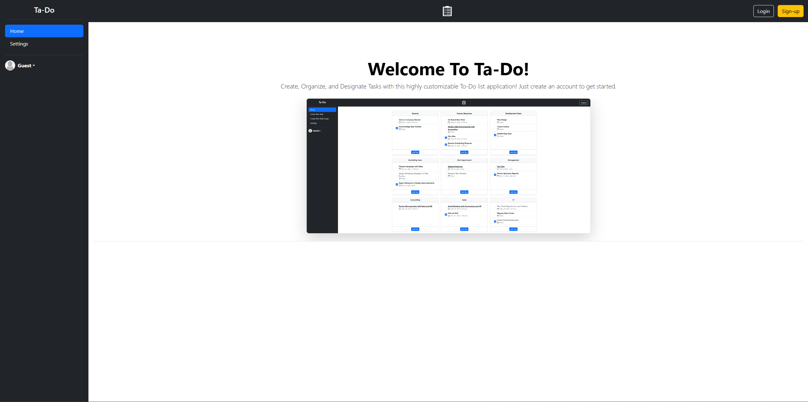
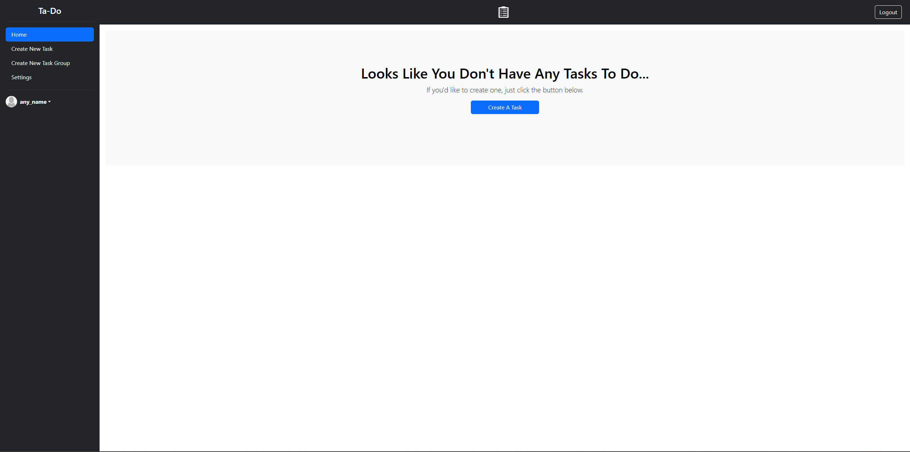
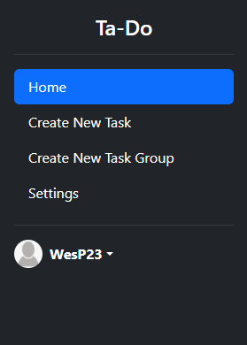
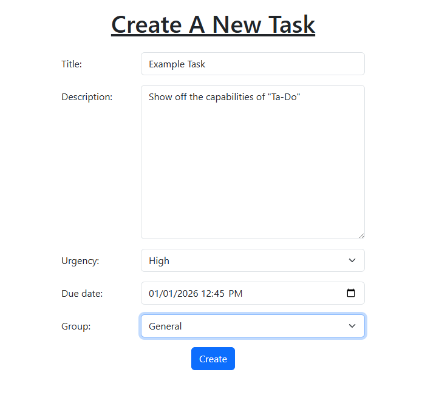
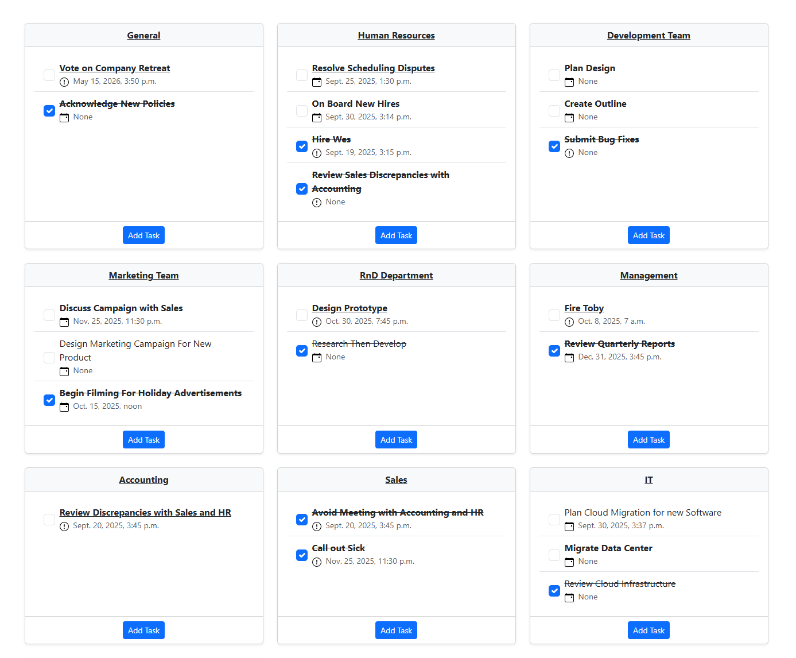
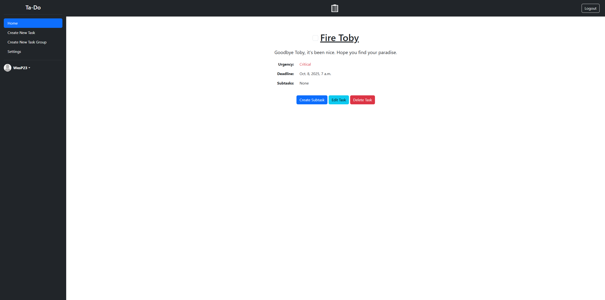
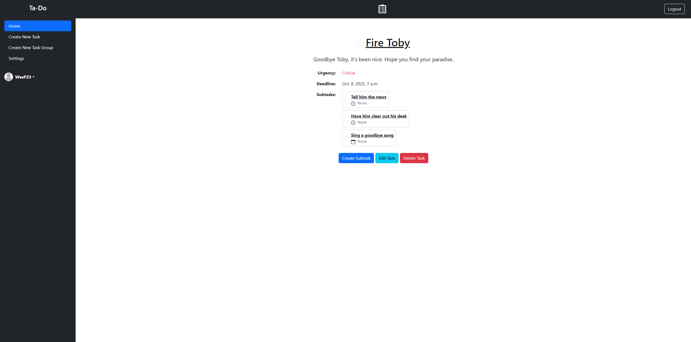
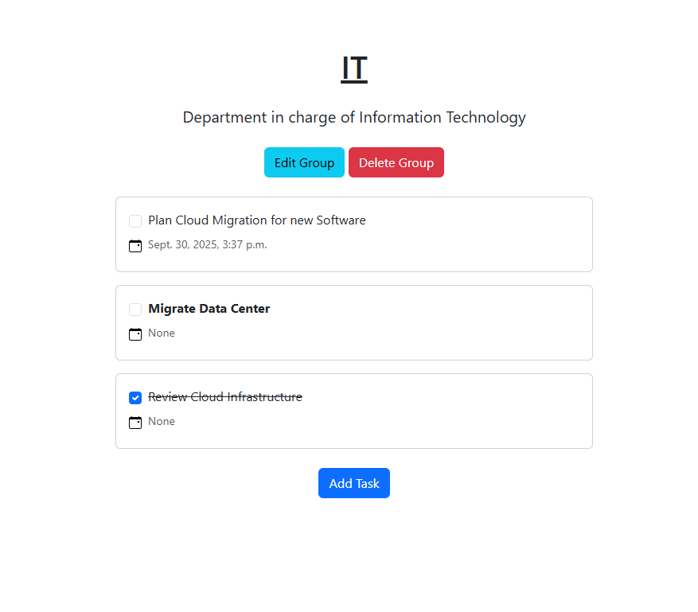
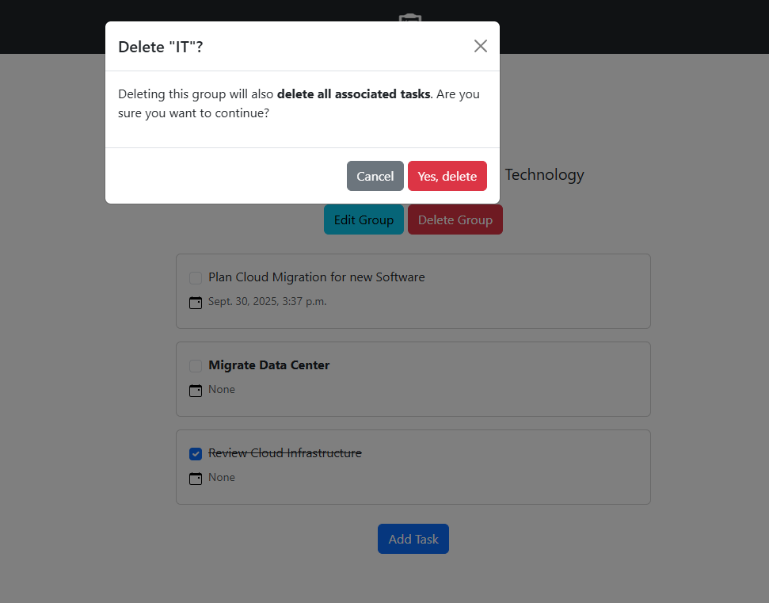

# Ta-Do
*An Organization Web-based Tool Built using Python, Django, PostgreSQL, and Bootstrap*

A simple and intuitive To-Do List web-application designed to help users organize tasks, track progress, and stay productive. 
This project focuses on clean design, ease of use, and a hierarchical system of task-management.

## Features

- Account Registration – Account login and signup system complete with salting and hashing of passwords

- Task Creation – Easily create task groups, tasks, and subtasks

- Task Hierarchy - Tasks can be neatly organized within task groups and be assigned subtasks contained within tasks

- Edit Tasks – Update tasks and task group details such as description, urgency, and deadline

- Mark and Delete Tasks – Track task completion or delete old tasks easily

- Dynamic task UI - Tasks update in accordance with task details ex. strikethrough when tasks are checked off

- Persistent Storage – Tasks are saved between sessions using a PostgreSQL database

- Responsive Design – Works across different screen sizes

## Planned Updates

- Optional email reminders when tasks approach deadlines
- Dark mode integration using Django
- Ability to assign editing privileges to other accounts limited by tasks or task groups. This will allow the application to be used in an organizational scope.

## Tech Stack

- **Python** 3.12.9
- **Django** 5.2.6 – Web framework
- **PostgreSQL** – Relational database
- **WTForms** 3.2.1 – Form handling and validation
- **WTForms-Django** 0.1 – Django integration for WTForms
- **psycopg2** 2.9.10 – PostgreSQL adapter for Django
- **asgiref** 3.9.1 – ASGI support
- **MarkupSafe** 3.0.2 – Safe string handling for templates
- **sqlparse** 0.5.3 – SQL parsing utilities
- **tzdata** 2025.2 – Time zone data support
- **gunicorn** 22.2.0 - Serves Django App to web
- **python-dotenv** 1.2.1 - For reading environmental variables in settings.py

## Getting Started

The easiest way to view this project is through Render by clicking on this link: https://ta-do-list.onrender.com

Note: Using the app through Render is for demonstration only, there is no persistent storage on Render as that would require a paid PostgreSQL plan. When viewing the app on Render, SQLite will be used instead of PostgreSQL.

Otherwise, if you'd like to run this project on your own machine, follow the steps below.

### Prerequisites

Python 3.9+ installed

pip package manager

### Installation

Clone the repository:
```bash
git clone https://github.com/JWesP23/To-Do-List-Website
cd Ta-Do-List/
```

### Create a virtual environment (recommended):
Using a virtual environment helps avoid dependency conflicts.

```bash
python -m venv venv
source venv/bin/activate   # macOS/Linux
venv\Scripts\activate      # Windows 
```

### Install dependencies:

```bash
pip install -r requirements.txt
```
### Environment Variables

Create a `.env` file in the project root with the following variables:

- `PYTHONUNBUFFERED` = 1
- `SECRET_KEY`

Replace SECRET_KEY with your Django key

If you wish to use PostgreSQL, add the following variables to your `.env` file:

- `DB_NAME`
- `DB_USER`
- `DB_PASSWORD`
- `DB_HOST`
- `DB_PORT`

See `.env.example` for reference.

Otherwise, the app will run SQLite locally.

### Running the Visualizer

```bash
python Ta_Do_List/manage.py runserver
```

In your terminal you'll see a link similar to:<br><code>"Starting development server at http://127.0.0.1:8000/"</code>

When you click the link, the app will open in your browser.

### Usage
The app is designed to be minimal and user-friendly, making task management very straightforward.

#### Signup
The first thing you will see is this page:<br>


You can create an account by clicking the "Sign Up" button.<br>
Note: You do not need to enter your actual email, there is no verification beyond ensuring that the string entered is an email and that the email is not already associated with an account.<br>


#### Task Creation
Once you are logged in, you will see this page:<br>


From here you can begin creating tasks and task groups by using the large button prompt or by navigating with the sidebar:<br>


Creating new tasks is easy, simply enter a title for the task and assign it to a task group, then create an optional description, designate an urgency level, and optionally assign a deadline. All of these values can be edited later.<br>


Once you have created multiple tasks and task groups, you'll see they organize themselves into a neat grid on the front page:<br>


#### Editing or Deleting a Task or Task Group
If you wish to edit or delete a task, simply click on the title of the task. You will then see a menu like this:<br>


After adding subtasks, the page for a task will look something like this:<br>


Similarly, if you wish to edit or delete a task group, you can access the appropriate menu by clicking on the task group's title. Doing so will direct you to a menu such as this: <br>


Deleting any task group will trigger a cascade that deletes any tasks within the group. Deleting any tasks will also delete all associated subtasks.<br>


## Project Structure
<pre>
Ta-Do-List/<br>
├── To_Do_List_Website/      # Root Django project directory, contains all application code
    ├── members/             # Django app handling user accounts, including registration, login, and authentication
        ├── views.py         # Django mandated file for functions related to members app
    ├── tasktracker/         # Django app responsible for task management such as creation, updates, and deletion
        ├── views.py         # Django mandated file for functions related to tasktracker app
    ├── static/              # Django-mandated directory for global static files such as CSS, JavaScript, and images
    ├── templates/           # Django mandated directory, stores main page HTML files
    ├── To_Do_List_Website/  # Inner Django project configuration directory
        ├── manage.py        # Django command-line utility used to run the server, migrations, and admin tasks
├── screenshots/             # Where the screenshots in this file are stored
├── requirements.txt         # List of Python dependencies required to run the project
├── README.md                # This file
└── .gitignore               # Git ignore file
</pre>

## License

This project is licensed under the MIT License. See the LICENSE file for details.
